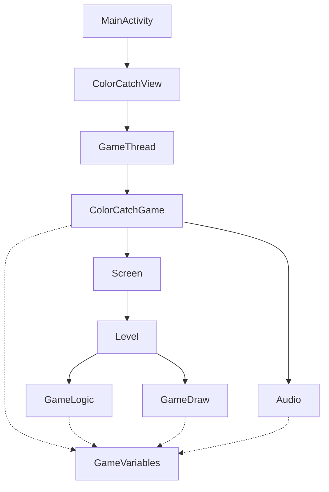

# ColorCatch architecture

Native Android Canvas game. A `SurfaceView` render thread drives screen and level factories, with two process-lifetime singletons holding almost all mutable state.

Source: `app/src/main/java/radical/appwards/colorcatch`.

Findings below come from code inspection of the game loop, not a runtime allocation profiler.

## Summary

| | |
| --- | --- |
| Render model | Classic `SurfaceView` + `Thread` |
| Shared state | `GameVariables` god-object singleton |
| Game loop | Uncapped FPS (no vsync, sleep, or delta time) |
| Content | 10 levels + ending screen |

The garbage collector is not broken. `GameThread.run()` lockCanvas / update / draw / unlock with no frame limiter. On a modern phone that loop can run hundreds of times per second. Every per-frame allocation (strings, `RectF`, shaders) hits the young generation that often, and ART never gets idle time to collect concurrently. Game speed is also tied to frame rate, so a faster device both allocates more and plays faster.

Enemy, shield, and movement-strategy pooling is the right instinct. It would be GC-friendly if the loop were capped and the remaining per-frame `new` calls were removed.

## Runtime shape

`MainActivity` owns the `SurfaceView`, options menu, and pause/resume audio + SQLite. `ColorCatchView` owns the render thread. `ColorCatchGame` is a thin facade that swaps `Screen` instances. Almost all mutable gameplay state lives in `GameVariables.getInstance()`, which every level, movement, draw, and audio path reads.

Dashed edges are `getInstance()` reads. `GameVariables` is a sink because `GameLogic`, `GameDraw`, `Audio`, and `ColorCatchGame` all call it.

### Layers

| Layer | Types | Role |
| --- | --- | --- |
| Activity | `MainActivity` | Lifecycle, menu, `SoundPool`/`MediaPlayer` create/release, save on pause |
| View / thread | `ColorCatchView.GameThread` | `lockCanvas`, synchronized update+draw, touch forwarding |
| Game facade | `ColorCatchGame` | Screen swap, touch coords into `GameVariables` |
| Screens | Loading / Menu / `GameScreenImpl` | Factory-selected; `GameScreenImpl` owns scoring and level advance |
| Levels | `Level01`–`10`, `LevelEnding` | Near-copies; each spins a background thread to init objects |
| Shared state | `GameVariables`, `Audio` | Process-lifetime singletons. Never cleared on destroy |

### Packages

Java packages under `app/src/main/java/radical/appwards/colorcatch`:

| Package | Responsibility | Coupling |
| --- | --- | --- |
| (root) | `MainActivity`, `ColorCatchView` | Holds thread + activity context |
| `game` | `ColorCatchGame` | Depends on `ScreenFactory` + both singletons |
| `screen` | Loading, Menu, Game | Menu uses RxJava 1; Game uses Snackbar |
| `level` | 10 levels + ending + factory | Each reimplements load-on-thread |
| `logic` | `GameLogic`, `GameDraw` | Collision, recycle, draw player/enemies |
| `objects` | `Player`, `Enemy`, `Shield`, `MultipleBlockEnemy` | `Enemy` delegates to `Movable` |
| `movements` | Strategy + `PlotPoints` | Path impl allocates `Point[]` per pixel |
| `variables` | `GameVariables` | Serializable god object; public fields |
| `audio` / `database` / `background` | SFX, SQLite, decorative shapes | `Audio` holds `MediaPlayer`; DB is raw SQL |

### Patterns in use

`ScreenFactory` and `LevelFactory` are simple string/int switches, not dependency injection. Movement is Strategy (`Movable`). `GameVariables` is a service locator / blackboard. The cost is that nothing is testable in isolation and the object graph is immortal for the process.

What is solid: `Level01` pre-allocates `Enemy[maxEnemies]` and six `Movable` arrays, then reuses slots with `setExist`. `Paint` objects are created once in `GameVariables`. Collision uses `Rect.intersects` on pooled rects.

## GC pressure

ART uses a concurrent generational collector. It handles a 60 Hz game with pooled objects easily. It does not handle an uncapped thread that also allocates. The loop in `ColorCatchView.GameThread.run()` is the multiplier on every other leak.

### Relative allocation pressure on the game thread

Qualitative 0–10 score from allocation sites × how often they run.

| Pressure | Site |
| ---: | --- |
| 10 | Uncapped `lockCanvas` loop |
| 9 | Menu `RadialGradient` / frame |
| 8 | Menu `PlotPoints` (touch / load) |
| 6 | HUD string concat / frame |
| 5 | Shield `new RectF` / draw |
| 4 | Level 8–10 `Point[]` paths |
| 3 | Snackbar on score |

### Hot allocation sites

| Site | What is allocated | When | Why GC hates it |
| --- | --- | --- | --- |
| `GameThread.run()` | Canvas lock, no frame limiter | Every iteration, as fast as CPU | Turns modest per-frame garbage into a firehose. Concurrent GC never idles. |
| `MenuScreenImpl.updatePhysics()` | `new RadialGradient` each tick | Menu, every physics pass | Native shader + Java object. Abandoned shader each frame. Menu is the worst screen for GC. |
| `PlotPoints.plotLine()` | `Point` per pixel along the line | Menu load, touch retarget, levels 8–10 init | On a 1080×2400 panel, menu builds ~(W×H)/10000 squares, each with hundreds of Points. Touch rebuilds all of them. |
| `GameScreenImpl` / `Level*.myDraw()` | `" Score: " + long`, `"Misses: " + int` | Every draw | `StringBuilder` + `String` at uncapped FPS. Easy to cache until values change. |
| `Shield.update()` | `new RectF(...)` every draw | While a shield is expanding (~10 frames) | `drawRect(float,float,float,float,Paint)` exists. `RectF` is pure garbage. |
| `GameScreenImpl.checkColorMatch()` | `Snackbar.make` + `getTargetColoText()` | On a successful color match | View inflation from the game thread (also a thread bug). Burst of short-lived objects. |

### What the collector cannot free

Singletons pin the live set. GC is not failing to run; it is not allowed to reclaim the game graph until process death.

| Pinned by | Retains | Effect |
| --- | --- | --- |
| `GameVariables.instance` | `Enemy[]`, 6× `Movable[]`, `Player`, Shields, 15+ Paints, `DisplayMetrics`, `ArrayList` xs/ys | Level loads replace some arrays (old ones can collect) but the singleton itself never dies. Activity recreate stacks more state on the same instance. |
| `Audio.instance` | `MediaPlayer`, `SoundPool`, `SparseIntArray`, last `Context` used for `load()` | `onDestroy` releases mp/sp, but the singleton still exists. `resumeAudio()` reallocates `soundsMap` every resume. |
| `MenuScreenImpl` Rx subscriptions | `PublishSubject` + nested Observables created per `ACTION_DOWN`, never unsubscribed | Leaks `MotionEvent` observers for the life of the menu screen. Old `MenuScreenImpl` can linger if `Screen` is swapped without disposing. |

### Secondary GC / jank contributors

- `GameVariables.initPaint()` mutates `Paint` on a background thread while the game thread may already draw with those Paints. `Paint` is not thread-safe; this can native-crash or produce torn state, which looks like random GC/jank.
- `ArrayList<Integer>` xs/ys on the ending screen boxes every touch and `remove(0)` copies the list. Ending also sets `levelEnemies = maxEnemies * 3`.
- foreach over `myShapes` in `GameScreenBackground` allocates an iterator. Tiny, but multiplied by the uncapped loop.
- `lockCanvas(null)` without a dirty rect copies the full surface every time. Combined with `canvas.drawColor(BLACK)` then a full-screen stroke rect, the GPU/CPU work per frame is far above 60 Hz needs.
- `GameThread.doDraw` calls `canvas.save()` then `restore()` with nothing in between. Harmless but pointless stack traffic.

## Bugs

| Severity | Where | What happens |
| --- | --- | --- |
| High | `GameThread.run()` | No delta time. Movement, timers (`gameTimer++`), enemy spawn, and shield growth all scale with FPS. Fast phones play a different game. |
| High | `GameScreenImpl.checkColorMatch()` | `Snackbar.make()` from the render thread. View / Looper work must be on the main thread. Can throw `CalledFromWrongThreadException` on score. |
| High | `SaveStateDb` vs `GameScreenImpl` | Saves `gv.level`, restores into `gv.level`, but continue uses `gv.currLevel`. Pause on level 7 can resume level 1. `setHealth()` also refuses to raise health, so a restore can no-op. |
| High | `Audio` | `musicOn` starts false, so `onPrepared` never starts playback until the user toggles music. `fSpeed` is 0 until `resumeAudio()`; `SoundPool.play` rate 0 is invalid. |
| Medium | `GameThread.setState()` | Pause/lose/ready puts visibility on key `""` (empty string). Handler reads `"viz"`. Missing key defaults to 0, so text still shows, but the intended protocol is broken. |
| Medium | `onWindowFocusChanged` | Pauses when focus is lost, never unpauses when focus returns. App switch / notification shade leaves the game stuck until a touch. |
| Medium | `surfaceCreated` / `surfaceDestroyed` | Thread is joined on destroy then a new `GameThread` is started. `colorCatch` and `gv` survive. Easy to start a thread whose previous holder is already gone; `lockCanvas` can return null (guarded) but race on `mRun` is only half-synchronized. |
| Low | `AndroidManifest` | Comment says portrait is locked. It is not. `surfaceChanged` will resize, but most layout math ran once from `DisplayMetrics`. |
| Low | `onTouchEvent` | Calls `performClick()` on every move, not only `ACTION_UP`. Also synchronized on the `SurfaceHolder`, so the UI thread can stall the render thread (and vice versa). |

### Lifecycle and leaks

`ColorCatchGame` and `GameThread` store the Activity `Context`. Combined with `GameVariables` living forever, a configuration change or Activity recreate keeps the old Activity reachable. `SoundPool` is created in `onCreate` and released in `onDestroy`; if `surfaceCreated` races destroy, `playSound` can NPE on `sp`.

### Save / continue

`SaveStateDb.insert()` appends a row every pause, then `getState()` reads the last row and `DROP TABLE`. That works as a single slot, but it does not persist enemy positions despite comments saying it would. `continuedGame` skips the `Level01` pool setup; later levels assume `enemyArray` already exists. A cold continue onto level 8 would NPE if `currLevel` were ever restored correctly without going through level 1 first.

### Copy-paste levels

`Level01` through `Level10` are near-duplicates (load thread, intro text, spawn timer). Bugs like string concat in `myDraw` and `gameVarsLoaded` flags are copied 10 times. `LevelFactory` returns null for an unknown id with no guard in `GameScreenImpl`.

## Improvements

Cap the loop first. That alone drops GC pressure by an order of magnitude and makes gameplay speed consistent. Then delete per-frame allocations. Architecture cleanup can follow without blocking a smooth 60 FPS.

Keep the pooling model. Enemy reuse, shield reuse, and prebuilt `Movable` strategies are the correct Android-game approach. After the loop is capped and `PlotPoints` / `RadialGradient` / HUD strings are gone, ART should barely show up in traces.

| Priority | Change | Why |
| --- | --- | --- |
| 1 | Cap `GameThread` at 60 FPS (`Choreographer` or elapsed-time sleep) and move with `dt` | Fixes speed scaling, heat, battery, and most GC. `gameTimer` should be time-based, not frame-based. |
| 2 | Stop allocating on the hot path | Reuse one `RadialGradient` or animate without new shaders. Cache HUD strings. Shield: `drawRect(l,t,r,b,paint)`. Indexed for-loops instead of for-each. |
| 3 | Plot paths as parametric motion, not `Point[pixelCount]` | `lerp(start, end, t)` needs two Points, not 2,000. Menu squares become cheap. Levels 8–10 stop dumping 100k objects at load. |
| 4 | Post UI to the main `Handler`: Snackbar, visibility, toasts | Stops wrong-thread crashes. Handler already exists on `ColorCatchView`. |
| 5 | One `Level` class with a config (spawn rate, movable set, enemy count) | Deletes ~9 copies. Fix scoring/HUD/GC once. |
| 6 | Replace `GameVariables` singleton with a `GameSession` owned by the Activity | Lets GC reclaim the world on destroy. Makes continue/save an explicit snapshot of `currLevel`, health, score, timer. |

### Smaller fixes worth doing in the same pass

- Default `musicOn = true`, initialize `fSpeed = 1f` in the `Audio` constructor, and load `SoundPool` samples once (not every `onResume`).
- Save `currLevel` (not `gv.level`), allow `setHealth` to set any non-negative value, and skip `DROP TABLE` in favor of a single-row UPSERT.
- Fix the Handler bundle key to `"viz"`. Unpause in `onWindowFocusChanged(true)`. Lock portrait in the manifest if that is still the intent.
- Dispose RxJava 1 subscriptions, or delete Rx and handle touch in `eventAction` like the rest of the game. RxJava 1 is unmaintained.
- Init Paints on the thread that draws them. Do not publish `Paint` mutations from a loader thread without a happens-before (join, or just do it on the game thread; 15 paints are cheap).
